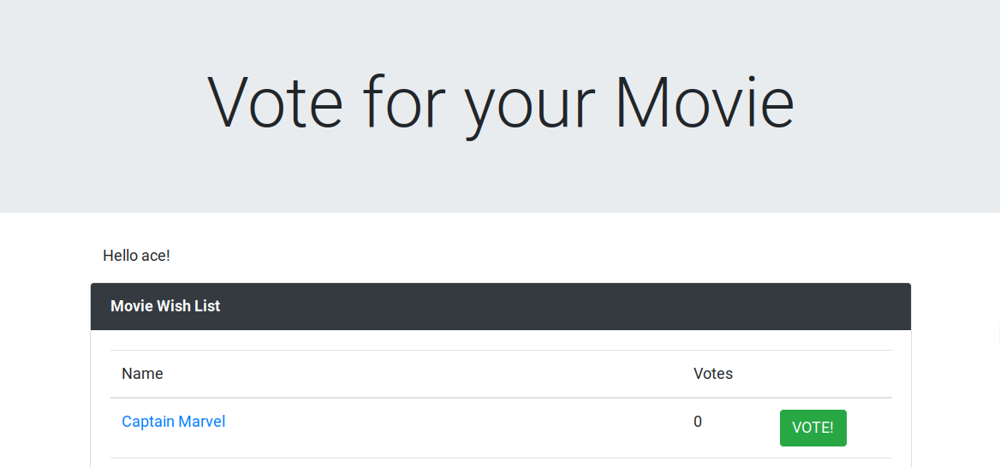
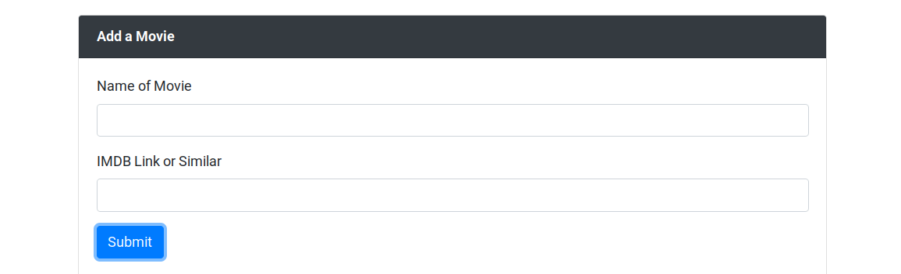

# Movie-voter

A self-hosted app that lets you choose a username, suggest movies, and vote on movies suggested by others.


This app uses hoodie (http://hood.ie) as an open source alternative to firebase. Hoodie provides offline-first data storage and allows syncing to a database. 


Users can add movies by providing a title and a link to a movie database to allow people to find trailers or see a movies actors




## Running

### Development

#### Database

The database is not required to run the app unless you require data to be synced between different users/browsers.

To run the database for development purposes, build the database image as seen under the [production](#Production) heading. Then comment out the `web` half of the `docker-compose.yml` file and run `docker-compose up -d` to start the database in the background.


#### Frontend

You may need to set some variables in `package.json` as outlined [here](http://docs.hood.ie/en/latest/guides/configuration.html) to tell the frontend about the database.

Heres a sample configuration to add into `package.json`:

```
  "hoodie": {
    "dbUrl": "localhost:5984",
    "dbUrlUsername": "admin",
    "dbUrlPassword": "password"
  }
```

Then open a terminal in the project directory folder and do either `npm install` or `yarn install` depending on your preference. then run `nom start` or `yarn start`. This will start a development server for the app frontend

You should see:
```
Your Hoodie app has started on: http://localhost:8080
Stop server with control + c
```

Now visit http://localhost:8080 in a web browser.

### Production (Docker)

1. Build the database image
```bash
cd db
docker build -t vote-db .
cd ../
```
2. Build the frontend image

```bash
docker build -t vote .
```
3. start them both up together using `docker-compose up`
4. Now visit http://localhost:8080 in a web browser.
5. optionally, transfer the images to another machine with [`docker save`](https://docs.docker.com/engine/reference/commandline/save/)
